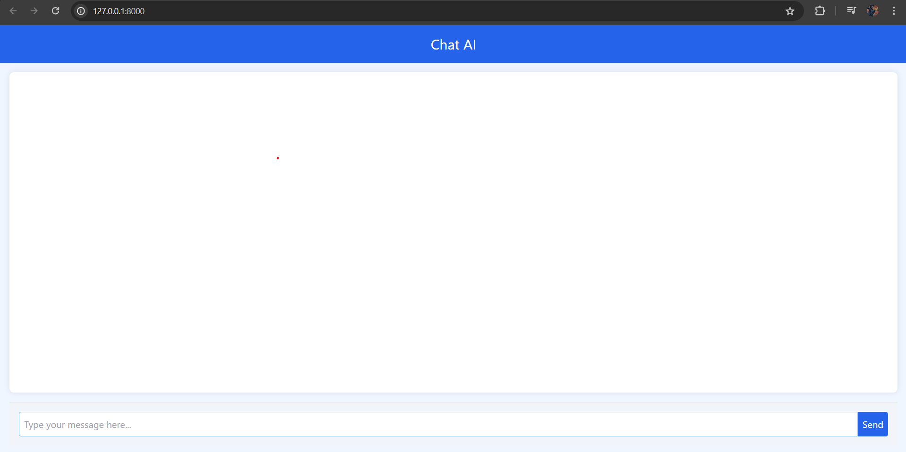

# ChatGPT Web App Clone
## About the Project
A chatbot is a software application designed to simulate human conversation through text or voice interactions. Utilizing natural language processing (NLP) and artificial intelligence (AI), chatbots can understand and respond to user queries in a conversational manner. To develop a fully functional web-based chatbot application similar to ChatGPT, utilizing the OpenAI GPT model for natural language processing. The application will be built using Python and Django for the backend, JavaScript for interactivity, Tailwind CSS for styling, and Circumeo for enhanced video creation and content generation capabilities.
## Tech Stack

- 

- 

- 

- 

## Getting Started

### Installation


Create a New Directory by typing following command in Command Prompt
```
mkdir chatgpt_clone
cd chhatgpt_clone
```
Create a virtual environment

```
python -m venv venv
venv/Scripts/activate
```

Install and create project and app

```
pip install django
python manage.py startproject chatgpt
cd chatgpt
python manage.py startapp chat
```
Save all the files inside corresponding apps and project

## Run the App
1. Create Database
```
python manage.py makemigrations
python manage.py migrate
```
2. Run the project
```
python manage.py runserver
```
## Screenshots of the Website

